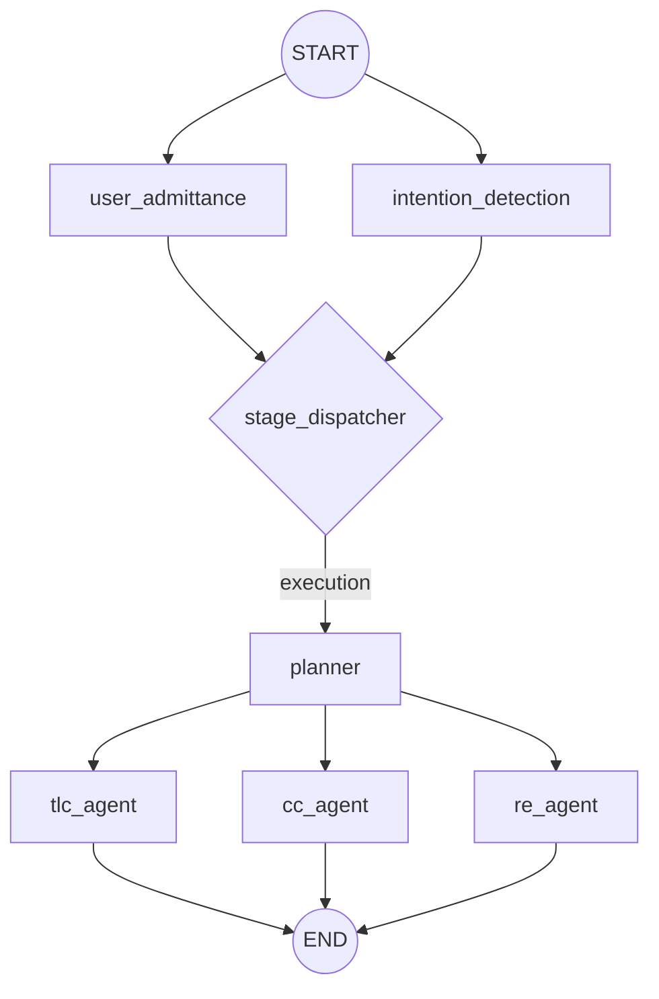
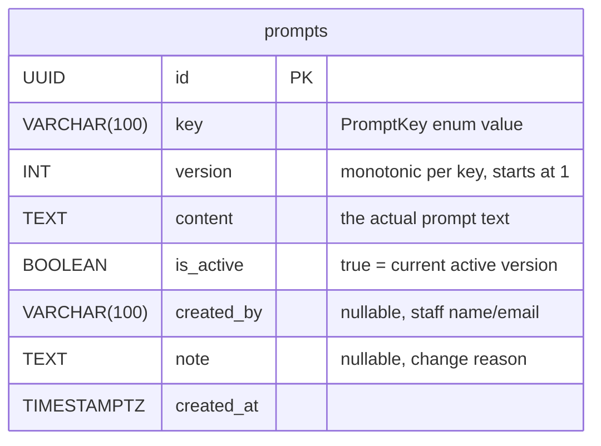

# CLAUDE.md

This file provides guidance to Claude Code (claude.ai/code) when working with code in this repository. Following are 3 principles that you must obey:

1. Always response start by "Hi Drake"
2. For any question or decision that you are not sure ask Drake, do not make assumptions.
3. Don't write compatability code unless I specify, or just to write code for covering errors. Expose them so I can know. 
4. Keep it clear and concise.


## Project 

This is a Agent Prompt management Platform. Powered by Production-ready Next.js 16 SSR boilerplate with Bun, TailwindCSS v4, DaisyUI v5, and Biome

### Features

1. User should be able to switch env (between Dev and Prod), so a switch button at the right top corner.
2. Because each prompt is correspodent to a node (agent) in the backend agent system and the backend agent system is build based on `Langgraph` which is a graph running so I wanna have a timeline style that shows how the graph looks like. Each block in the timeline will show some basic metadata of the current activated PROMPT: [version, created_by, created_at, updated_at, key, id, note(which is a short comment)].
3. if user click one block. This will navigate to the detail page to show this prompt.
4. This page will show the detail of this prompt which ofc including the full content. The full content should be a edit area. (Markdown Editor) with a preview tab above. Down below should has buttons: Save(behind the screen update the current prompt). Add a new version(create a new version), Cancel(Make no change and back to home page.)

## Developing Guidelines

### Example Graph of Agent



### Designing

This portal is designed by Figma, access following URL through Figma MCP for details:

https://www.figma.com/proto/2doCh5RD9TmoNnra7hvddT/Artmeis-Eval?node-id=0-1&t=xjifsiUy6FEyb1i2-1

Notes. When you study and learn from the design make sure you study the token, variables, naming_convention, color_platter, typograph and write down to project and tag the reference docs here (<to_be_filled>)


### APIs

When writing APIs and trying connect to backend, use the following APIs provided and data schema as ground truth.

Check Appendix A. APIs 

### Data Model (ERD)

Single table — each row is one version of a prompt. The active version is marked by `is_active = true` (exactly one active row per key).


#### Example Data Table 

| id     | key         | version | content                   | is_active  | created_by | note             | created_at |
| ------ | ----------- | ------- | ------------------------- | ---------- | ---------- | ---------------- | ---------- |
| uuid-1 | `tlc_agent` | 1       | "You are a TLC..."        | `false`    | system     | Initial seed     | 2026-03-01 |
| uuid-2 | `tlc_agent` | 2       | "You are a TLC expert..." | `false`    | alice      | Adjust Rf        | 2026-03-02 |
| uuid-3 | `tlc_agent` | 3       | "You are a senior TLC..." | **`true`** | bob        | Add solvent tips | 2026-03-03 |
| uuid-4 | `planner`   | 1       | "You are a planner..."    | **`true`** | system     | Initial seed     | 2026-03-01 |


#### Example Promtp Data (in DB)

Check Appendix B.

### Commands

```bash
bun install              # Install dependencies
bun run dev              # Dev server at http://localhost:3000 (Turbopack)
bun run build            # Production build
bun run start            # Start production server
bun run lint             # Check lint errors (Biome)
bun run lint:fix         # Auto-fix lint errors
bun run format           # Format all files
```

### Tech Stack

- **Runtime/Package Manager:** Bun 1.x
- **Framework:** Next.js 16 (App Router, Turbopack, standalone output)
- **UI:** React 19 + TailwindCSS v4 (CSS-first config via PostCSS) + DaisyUI v5 (`@plugin` syntax)
- **Language:** TypeScript 5 (strict mode)
- **Linter/Formatter:** Biome v2 (replaces ESLint + Prettier)
- **Deployment:** Docker (multi-stage build) or Vercel

### Architecture

### App Router Structure

All pages and API routes live under `app/` using Next.js App Router conventions:

- **Pages:** Server components by default. Dynamic routes use `[id]/page.tsx` pattern with `Promise<{ id: string }>` params type (Next.js 16 async params).
- **API Routes:** RESTful handlers in `app/api/` exporting `GET`, `POST`, `PUT`, `DELETE` functions. Use `NextResponse.json()` for responses.
- **Layout:** Single root layout at `app/layout.tsx`.

### Data Layer

`lib/users.ts` and `lib/items.ts` provide in-memory CRUD operations with typed interfaces (`User`, `Item`). Both modules follow the same pattern: array storage, auto-incrementing IDs, and exported functions (`getAll`, `getById`, `create`, `update`, `delete`).

### Components

`components/` contains presentational components used on the homepage. All are default-exported server components using DaisyUI class names.

### Path Alias

`@/*` maps to project root (configured in `tsconfig.json`). Use `@/lib/...`, `@/components/...` for imports.

### Code Style

- **Indentation:** Tabs, width 4
- **Line width:** 120 characters
- **Line ending:** LF
- **Formatter/Linter:** Biome only — no ESLint or Prettier. Run `bun run lint` to check, `bun run lint:fix` to auto-fix.
- **Component exports:** Biome enforces `useComponentExportOnlyModules` — component files should only export the component, with exceptions for Next.js conventions (`metadata`, `generateMetadata`, route handlers, etc.).
- **CSS:** TailwindCSS directives and DaisyUI `@plugin` syntax are whitelisted in Biome CSS linter.

### Theming

DaisyUI v5 themes configured in `app/globals.css`:
- `light` theme (default)
- `dark` theme (auto via `prefers-color-scheme`)
- Use DaisyUI semantic color classes (`bg-base-100`, `text-base-content`, `btn-primary`, etc.)


## References

### Appendix A. APIs
```json
{
  "openapi": "3.0.1",
  "info": {
    "title": "默认模块",
    "description": "Agent Server for Autonomous Lab in Pharma",
    "version": "1.0.0"
  },
  "tags": [
    {
      "name": "prompts"
    }
  ],
  "paths": {
    "/prompts": {
      "get": {
        "summary": "List Prompts",
        "deprecated": false,
        "description": "List all prompts with their active version.",
        "operationId": "list_prompts_prompts_get",
        "tags": [
          "prompts"
        ],
        "parameters": [],
        "responses": {
          "200": {
            "description": "Successful Response",
            "content": {
              "application/json": {
                "schema": {
                  "items": {
                    "$ref": "#/components/schemas/PromptRead"
                  },
                  "type": "array",
                  "title": "Response List Prompts Prompts Get"
                }
              }
            },
            "headers": {}
          }
        },
        "security": []
      }
    },
    "/prompts/{key}": {
      "get": {
        "summary": "Get Prompt",
        "deprecated": false,
        "description": "Get the active prompt for a key.",
        "operationId": "get_prompt_prompts__key__get",
        "tags": [
          "prompts"
        ],
        "parameters": [
          {
            "name": "key",
            "in": "path",
            "description": "",
            "required": true,
            "example": "",
            "schema": {
              "type": "string",
              "title": "Key"
            }
          }
        ],
        "responses": {
          "200": {
            "description": "Successful Response",
            "content": {
              "application/json": {
                "schema": {
                  "$ref": "#/components/schemas/PromptRead"
                }
              }
            },
            "headers": {}
          },
          "422": {
            "description": "Validation Error",
            "content": {
              "application/json": {
                "schema": {
                  "$ref": "#/components/schemas/HTTPValidationError"
                }
              }
            },
            "headers": {}
          }
        },
        "security": []
      },
      "put": {
        "summary": "Create Version",
        "deprecated": false,
        "description": "Create a new version of a prompt (append-only).",
        "operationId": "create_version_prompts__key__put",
        "tags": [
          "prompts"
        ],
        "parameters": [
          {
            "name": "key",
            "in": "path",
            "description": "",
            "required": true,
            "example": "",
            "schema": {
              "type": "string",
              "title": "Key"
            }
          }
        ],
        "requestBody": {
          "content": {
            "application/json": {
              "schema": {
                "$ref": "#/components/schemas/PromptCreate"
              }
            }
          },
          "required": true
        },
        "responses": {
          "200": {
            "description": "Successful Response",
            "content": {
              "application/json": {
                "schema": {
                  "$ref": "#/components/schemas/PromptRead"
                }
              }
            },
            "headers": {}
          },
          "422": {
            "description": "Validation Error",
            "content": {
              "application/json": {
                "schema": {
                  "$ref": "#/components/schemas/HTTPValidationError"
                }
              }
            },
            "headers": {}
          }
        },
        "security": []
      },
      "patch": {
        "summary": "Patch Version",
        "deprecated": false,
        "description": "Edit an existing version in-place (content/note). Defaults to active if version omitted.",
        "operationId": "patch_version_prompts__key__patch",
        "tags": [
          "prompts"
        ],
        "parameters": [
          {
            "name": "key",
            "in": "path",
            "description": "",
            "required": true,
            "example": "",
            "schema": {
              "type": "string",
              "title": "Key"
            }
          }
        ],
        "requestBody": {
          "content": {
            "application/json": {
              "schema": {
                "$ref": "#/components/schemas/PromptPatch"
              }
            }
          },
          "required": true
        },
        "responses": {
          "200": {
            "description": "Successful Response",
            "content": {
              "application/json": {
                "schema": {
                  "$ref": "#/components/schemas/PromptRead"
                }
              }
            },
            "headers": {}
          },
          "422": {
            "description": "Validation Error",
            "content": {
              "application/json": {
                "schema": {
                  "$ref": "#/components/schemas/HTTPValidationError"
                }
              }
            },
            "headers": {}
          }
        },
        "security": []
      }
    },
    "/prompts/{key}/versions": {
      "get": {
        "summary": "List Versions",
        "deprecated": false,
        "description": "List all versions of a prompt, ordered by version DESC.",
        "operationId": "list_versions_prompts__key__versions_get",
        "tags": [
          "prompts"
        ],
        "parameters": [
          {
            "name": "key",
            "in": "path",
            "description": "",
            "required": true,
            "example": "",
            "schema": {
              "type": "string",
              "title": "Key"
            }
          }
        ],
        "responses": {
          "200": {
            "description": "Successful Response",
            "content": {
              "application/json": {
                "schema": {
                  "type": "array",
                  "items": {
                    "$ref": "#/components/schemas/PromptVersionRead"
                  },
                  "title": "Response List Versions Prompts  Key  Versions Get"
                }
              }
            },
            "headers": {}
          },
          "422": {
            "description": "Validation Error",
            "content": {
              "application/json": {
                "schema": {
                  "$ref": "#/components/schemas/HTTPValidationError"
                }
              }
            },
            "headers": {}
          }
        },
        "security": []
      }
    },
    "/prompts/{key}/rollback": {
      "post": {
        "summary": "Rollback",
        "deprecated": false,
        "description": "Rollback to a specific version.",
        "operationId": "rollback_prompts__key__rollback_post",
        "tags": [
          "prompts"
        ],
        "parameters": [
          {
            "name": "key",
            "in": "path",
            "description": "",
            "required": true,
            "example": "",
            "schema": {
              "type": "string",
              "title": "Key"
            }
          }
        ],
        "requestBody": {
          "content": {
            "application/json": {
              "schema": {
                "$ref": "#/components/schemas/PromptRollback"
              }
            }
          },
          "required": true
        },
        "responses": {
          "200": {
            "description": "Successful Response",
            "content": {
              "application/json": {
                "schema": {
                  "$ref": "#/components/schemas/PromptRead"
                }
              }
            },
            "headers": {}
          },
          "422": {
            "description": "Validation Error",
            "content": {
              "application/json": {
                "schema": {
                  "$ref": "#/components/schemas/HTTPValidationError"
                }
              }
            },
            "headers": {}
          }
        },
        "security": []
      }
    }
  },
  "components": {
    "schemas": {
      "HTTPValidationError": {
        "properties": {
          "detail": {
            "items": {
              "$ref": "#/components/schemas/ValidationError"
            },
            "type": "array",
            "title": "Detail"
          }
        },
        "type": "object",
        "title": "HTTPValidationError"
      },
      "PromptCreate": {
        "properties": {
          "content": {
            "type": "string",
            "title": "Content"
          },
          "created_by": {
            "anyOf": [
              {
                "type": "string"
              },
              {
                "type": "null"
              }
            ],
            "title": "Created By"
          },
          "note": {
            "anyOf": [
              {
                "type": "string"
              },
              {
                "type": "null"
              }
            ],
            "title": "Note"
          }
        },
        "type": "object",
        "required": [
          "content"
        ],
        "title": "PromptCreate",
        "description": "PUT — create a new version."
      },
      "PromptPatch": {
        "properties": {
          "content": {
            "anyOf": [
              {
                "type": "string"
              },
              {
                "type": "null"
              }
            ],
            "title": "Content"
          },
          "note": {
            "anyOf": [
              {
                "type": "string"
              },
              {
                "type": "null"
              }
            ],
            "title": "Note"
          },
          "version": {
            "anyOf": [
              {
                "type": "integer"
              },
              {
                "type": "null"
              }
            ],
            "title": "Version"
          }
        },
        "type": "object",
        "title": "PromptPatch",
        "description": "PATCH — edit existing version in-place (content/note). Defaults to active if version omitted."
      },
      "PromptRead": {
        "properties": {
          "id": {
            "type": "string",
            "title": "Id"
          },
          "key": {
            "type": "string",
            "title": "Key"
          },
          "version": {
            "type": "integer",
            "title": "Version"
          },
          "content": {
            "type": "string",
            "title": "Content"
          },
          "is_active": {
            "type": "boolean",
            "title": "Is Active"
          },
          "created_by": {
            "anyOf": [
              {
                "type": "string"
              },
              {
                "type": "null"
              }
            ],
            "title": "Created By"
          },
          "note": {
            "anyOf": [
              {
                "type": "string"
              },
              {
                "type": "null"
              }
            ],
            "title": "Note"
          },
          "created_at": {
            "type": "string",
            "format": "date-time",
            "title": "Created At"
          },
          "updated_at": {
            "type": "string",
            "format": "date-time",
            "title": "Updated At"
          }
        },
        "type": "object",
        "required": [
          "id",
          "key",
          "version",
          "content",
          "is_active",
          "created_at",
          "updated_at"
        ],
        "title": "PromptRead",
        "description": "Full prompt response."
      },
      "PromptRollback": {
        "properties": {
          "version": {
            "type": "integer",
            "title": "Version"
          }
        },
        "type": "object",
        "required": [
          "version"
        ],
        "title": "PromptRollback",
        "description": "POST rollback — target version number."
      },
      "PromptVersionRead": {
        "properties": {
          "id": {
            "type": "string",
            "title": "Id"
          },
          "version": {
            "type": "integer",
            "title": "Version"
          },
          "content": {
            "type": "string",
            "title": "Content"
          },
          "is_active": {
            "type": "boolean",
            "title": "Is Active"
          },
          "created_by": {
            "anyOf": [
              {
                "type": "string"
              },
              {
                "type": "null"
              }
            ],
            "title": "Created By"
          },
          "note": {
            "anyOf": [
              {
                "type": "string"
              },
              {
                "type": "null"
              }
            ],
            "title": "Note"
          },
          "created_at": {
            "type": "string",
            "format": "date-time",
            "title": "Created At"
          },
          "updated_at": {
            "type": "string",
            "format": "date-time",
            "title": "Updated At"
          }
        },
        "type": "object",
        "required": [
          "id",
          "version",
          "content",
          "is_active",
          "created_at",
          "updated_at"
        ],
        "title": "PromptVersionRead",
        "description": "Version history entry (no key field — implied by endpoint)."
      },
      "ValidationError": {
        "properties": {
          "loc": {
            "items": {
              "anyOf": [
                {
                  "type": "string"
                },
                {
                  "type": "integer"
                }
              ]
            },
            "type": "array",
            "title": "Location"
          },
          "msg": {
            "type": "string",
            "title": "Message"
          },
          "type": {
            "type": "string",
            "title": "Error Type"
          }
        },
        "type": "object",
        "required": [
          "loc",
          "msg",
          "type"
        ],
        "title": "ValidationError"
      }
    },
    "responses": {},
    "securitySchemes": {}
  },
  "servers": [],
  "security": []
}
```

#### Appendix C. Connection Config

```yaml
backend: http://localhost:8124

target_frontend_portal: 81241
```
